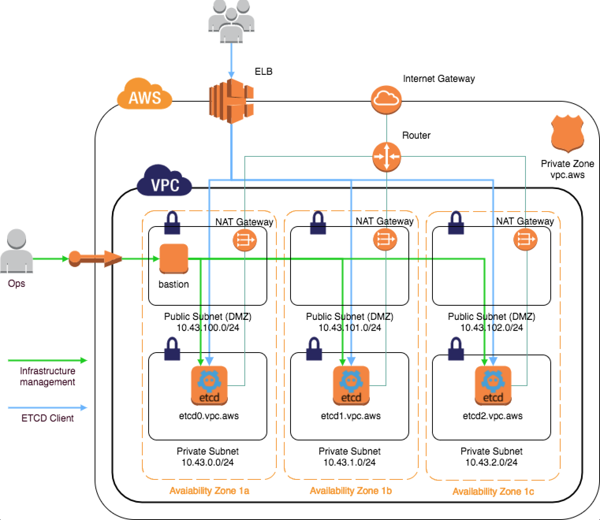

# Deployment of K/V database (ETCD cluster) on AWS using Terraform and Ansible Provisioning a clustered, HA application on AWS, using Terraform and Ansible

This project is demonstrating how to use Terraform and Ansible to provision the infrastructure, install and configure a clustered, High Availability K/V ETCD database application on AWS Cloud Environment. In order to secure access to internal cluster we will use Linux Bastion host on AWS. 

The infrastructure will be deployed as follows:

- Deployment of 3 *ETCD* nodes cluster. All three instances will be provisioned in separate Availability Zones.
- *ETCD* API exposed through a Load Balancer.
- Separate VPC private and public subnets. *ETCD* nodes not directly accessible from the Internet, but managed through a *BASTION*.
- The internal Private DNS zone. All three nodes will be assigned with a fixed internal DNS names.
- Nodes maintain their DNS records at boot, using cloud-init (as opposed to DNS records statically managed at provisioning-time).
- *ETCD* cluster uses dynamic [DNS discovery](https://etcd.io/docs/v3.4.0/op-guide/clustering/#dns-discovery).
- *ETCD* data on separate persistent EBS volumes.

## Requirements

We will need a AWS account with [permissions](docs/aws_permissions.md).

Requirements on the local machine which will control the provisioning process:

- Terraform 0.11.8
- Python 2.7.16
- Ansible 2.8.1
- AWS CLI

## Running the project

* [Credentials](docs/credentials.md)
* [Set up environment](docs/environment.md)
* [Provision the infrastructure, with Terraform](docs/terraform.md)
* [Install and configuring etcd, with Ansible](docs/ansible.md)
* [Verify etcd is working](docs/test_etcd.md)
